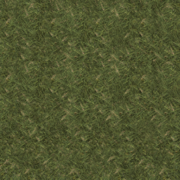

# tile-transition-combiner

Project requires graphicsmagic http://www.graphicsmagick.org/ installed as global command.

### Installation
`yarn global add tile-transition-combiner` or `npm i tile-transition-combiner -g`

### Usage as CLI
`tile-transition-combiner <tilesDirectory> [custom masksDirectory]`

### Usage in project
```ts
import tileCombiner = require("tile-transition-combiner"),
tileCombiner.config({
    // tilesDir: "./tiles",
    // tilesResizedDir: "./tiles-resized",
    // tilesOutDir: "./tiles-out",
    // tilePalettesDir: "./tile-palettes",
    // masksDir: "./masks",
    // testMask: "./mask.png",

    // tileColumns: 3,
    // tileSize: 64,
    // maxPalette: 510,
});

tileCombiner.combine().then(()=>{
    console.log("Done.");
});
```

### Input



### Output

